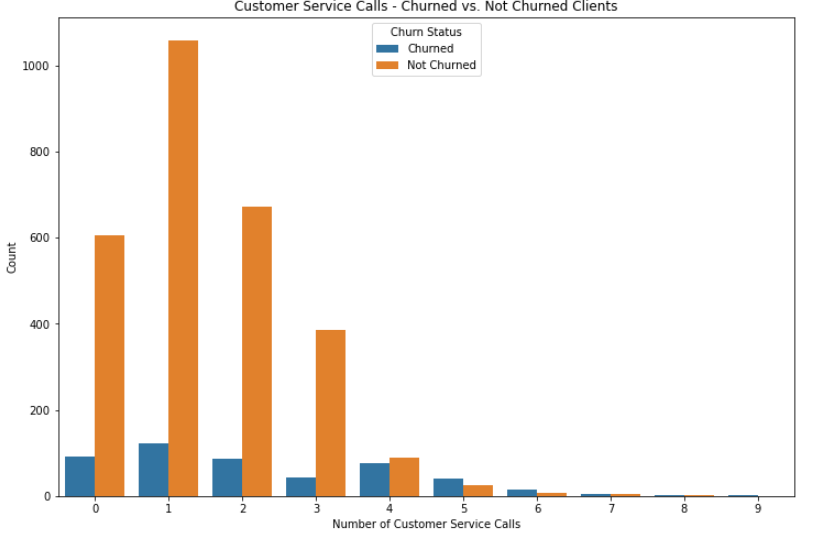
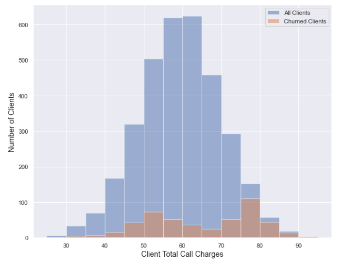
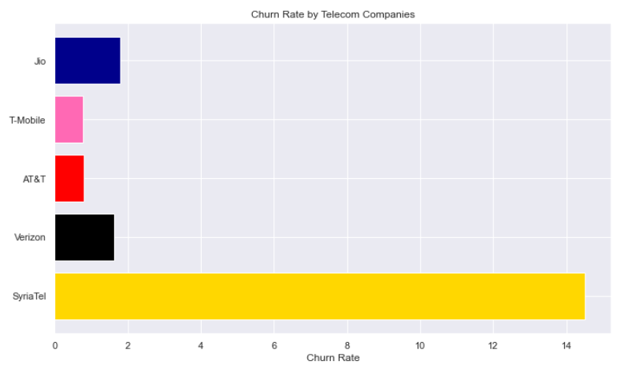
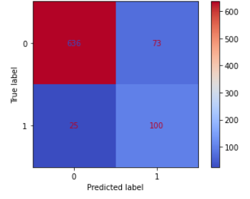

# Phase 3 Project

Table of Contents

* [***Project Overview:***](#project-overview)

* [***Visualisations using Stills:***](#visualisations-using-stills) 

* [***Conclusion:***](#conclusion)

* [***Notebooks:***](#notebooks)

## Project Overview
I have been hired by SyriaTel telecom business in order to reduce the amount of money they are losing to customers churning.
My task is to help uncover patterns and data trends within the company to help SyriaTel regain its losses and move in a positive direction.

# Dataset Description
This Dataset contains 3333 entries about customer churn
Data Sets can be found in 
* [ChurnData](Data/churn.csv) 
* [cleanedData](Data/clean_churn.csv)

Link to the Data's source
* [Churn](https://www.kaggle.com/datasets/becksddf/churn-in-telecoms-dataset)) - A Kaggle Dataset

## Visualisations Using stills

Customer service calls of clients who churned and have not

Churned and non-churned clients spending

Compared to the competition 

Grid Search best-performing model 

## Conclusion
Our current logistic regression model has been a game-changer in our efforts to reduce churn. But we're not stopping there – we're about to dive even deeper into the data game. Our plan? First, we want to figure out what's making other companies churn less. That way, we can help our clients do the same and keep them happy. Second, we're jazzing up our data by bringing in info on new and old clients. This means we'll have more to work with, which lets us uncover even more reasons why people might churn. So, get ready for some exciting data adventures as we continue to rock the churn reduction world!

### Notebooks
* [Notebooks]([Notebooks/Notebook #1.ipynb](https://github.com/GitHbGav/3-project/blob/main/Notebooks/Notebook%20%231.ipynb))  - Data Cleaning

* [Notebooks]([Notebooks/Notebook #2.ipynb](https://github.com/GitHbGav/3-project/blob/main/Notebooks/Notebook%20%232.ipynb))  - Data Visualization 

* [Notebooks]([Notebooks/Notebook #3.ipynb](https://github.com/GitHbGav/3-project/blob/main/Notebooks/Notebook%20%233.ipynb)) - Modle Building 

  

## Linkedin
Gavin Martin   

## References
(Upsplash Image)https://unsplash.com/photos/YzZJUXjb9aw
(Upsplash image)
